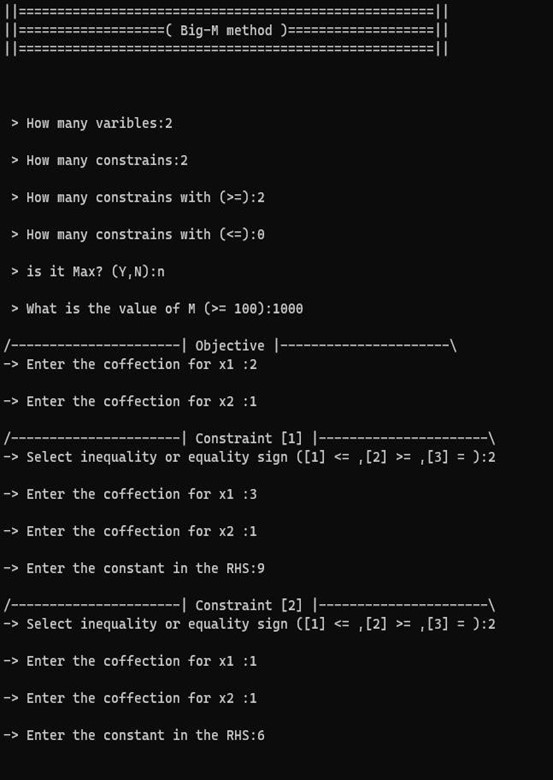
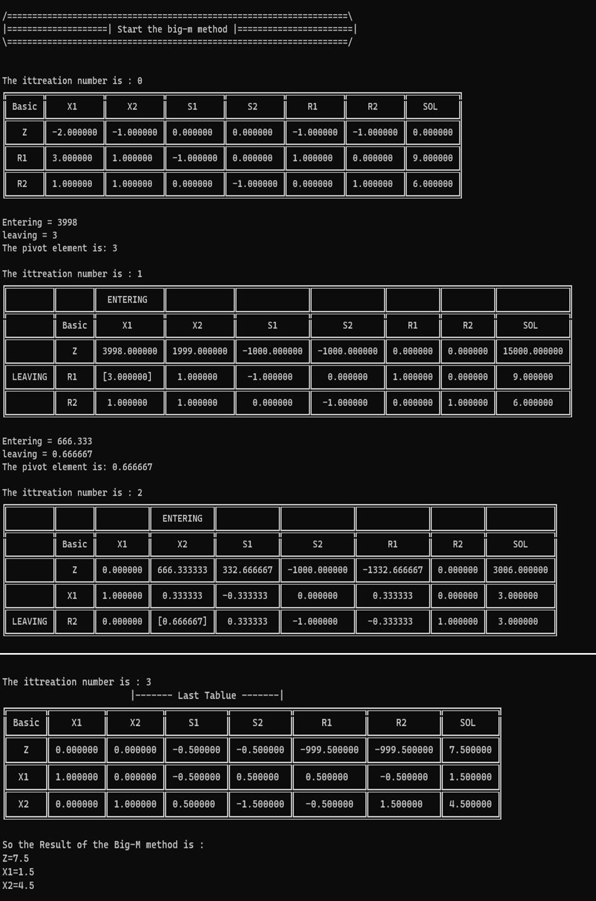

# Big-M Calculator
## Introduction
Big-M method is a mathematical optimization technique commonly used in linear programming to solve linear programming problems.

## Requiremnt
|Requirment|
|-|
[Visual studio 2022](https://visualstudio.microsoft.com/vs/) with [C++17](https://learn.microsoft.com/en-us/cpp/overview/install-c17-support?view=msvc-170) standard enabled

## Libraries 
|Libarary|
|-|
|[CppConsoleTable](https://github.com/DenisSamilton/CppConsoleTable) by DenisSamilton|

## Example
You don't have to make the equation in standerd from.
**<center>**

$\min  z = 2x_1 + x_2$<br>
$3x_1 + x_2 \geq 9$<br>
$x_1 + x_2 \geq 6$<br>
$x1,x2 \geq 0$

</center>

---

Result:<br>
    
<br>
    
<br>

```
 As you can see after applying the method The result is: 
 Z = 7.5
 x1 = 1.5
 x2 = 4.5
``` 
